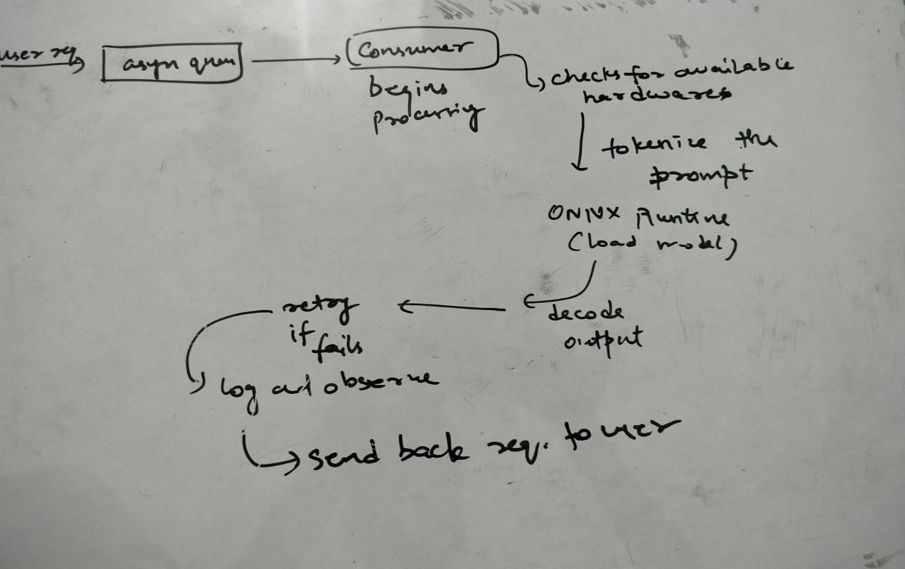

#  GPU-Aware ML Inference Engine

A scalable, hardware-aware machine learning inference engine built with **FastAPI** and **ONNX Runtime**, designed to serve transformer models with dynamic routing across GPU **NVIDIA**, **AMD**, or **CPU** devices. Includes intelligent request queuing, auto-retry logic, observability stack (Prometheus + Grafana + Loki), and Dockerized deployment.

---

## Features

-  Serve transformer models (e.g., GPT-2) using ONNX Runtime
-  Dynamic GPU/CPU/ execution provider routing
-  Asynchronous request queue and auto-retry mechanism
-  Full observability: Prometheus for metrics, Grafana for dashboards, Loki for logs
-  Dockerized for consistent deployment across environments
-  Fault-tolerant, scalable, and ready for production use

---

##  Tech Stack

- **Languages**: Python (FastAPI), Bash
- **Inference & ML**: ONNX Runtime, Hugging Face Transformers
- **Infra**: Docker, AsyncIO, REST API
- **Monitoring**: Prometheus, Grafana, Loki

---

##  Architecture

```plaintext
Client
  |
  ↓
FastAPI Inference API
  ├── Preprocessing / Validation
  ├── Async Queue
  ├── Retry & Timeout Logic
  ├── Execution Provider Selector (GPU / CPU )
  └── ONNX Inference Engine
       └── Response
  |
  └── Logs / Metrics → Loki / Prometheus / Grafana
```

## Status
Project is under active development.
Initial implementation of model serving, monitoring stack, and queue-based retry system in progress.

 🧠 Initial Architecture (Whiteboard Draft)

This is the first draft of the system architecture for the GPU Inference Project.



